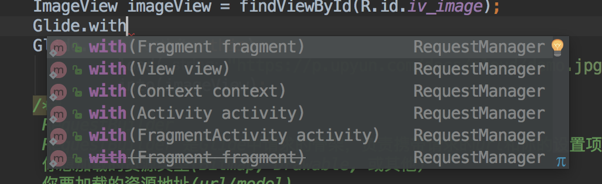
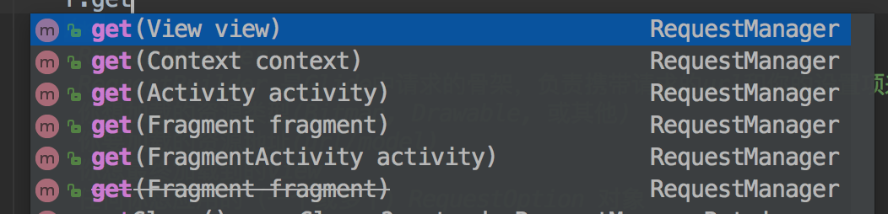

## Glide源码分析（一），基本加载代码流程
所有分析均是基于glide tag 4.7.1的代码

下面来看在Glide中最简单的图片加载代码

```
       Glide.with(this)
                .load("https://p.upyun.com/docs/cloud/demo.jpg")
                .into(imageView);
```
这应该是相对比较简单的加载图片的代码了，一步步来，看代码其实很讲究耐心，有时候会遇到很多层次的调用链，这个时候其实很有必要自己画一些图，很能帮助理清一些思路。下面来看这段比较看似比较简单的代码，其实在Glide源码中，运用到了大量的类的设计，后面涉及的我会慢慢介绍到。  

首先简单介绍下这个Glide类，它相当于是整个框架的调用入口，有一点像外观模式，一般很多第三方sdk都会用到这种模式，提供一个高层接口，减少用户的使用成本，对于我们第一个with方法，这个其实就是一个工厂方法，虽然有许多重载的形式，其实都是要创建一个RequestManager对象。下面我们来看这个
这个with方法，如下：



Glide#with方法有六个重载的形式，但是第一部分都是调用Glide#getRetriever获取一个RequestManagerRetriever对象，进而调用RequestManagerRetriever#get方法最终创建一个RequestManager对象。下面一个个来进行分析。
###1.Glide#with

```
  @NonNull
  public static RequestManager with(@NonNull FragmentActivity activity) {
    return getRetriever(activity).get(activity);
  }
```
还有其他的重载形式，其实第一部分都是一样，都是获取他们(Actvity/View/Fragment等)的上下文，然后通过getRetriever方法去获取一个RequestManagerRetriever对象。进而得到一个RequestManager。
###2.Glide#getRetriever 

```
  @NonNull
  private static RequestManagerRetriever getRetriever(@Nullable Context context) {
    // Context could be null for other reasons (ie the user passes in null), but in practice it will
    // only occur due to errors with the Fragment lifecycle.
    Preconditions.checkNotNull(
        context,
        "You cannot start a load on a not yet attached View or a Fragment where getActivity() "
            + "returns null (which usually occurs when getActivity() is called before the Fragment "
            + "is attached or after the Fragment is destroyed).");
    return Glide.get(context).getRequestManagerRetriever();
  }
```
这个方法先是进行了context的非空检查，然后调用Glide#get方法

###3.Glide#get
```
  @NonNull
  public static Glide get(@NonNull Context context) {
    if (glide == null) {
      synchronized (Glide.class) {
        if (glide == null) {
          checkAndInitializeGlide(context);
        }
      }
    }

    return glide;
  }
```
这个方法的主要逻辑是构建一个Glide的单例对象，初始化Glide对象时，做了很多复杂的配置信息，包括缓存策略等等，这里我们暂时跳过，后续讲到这些配置信息再详细分析，有时候，看代码要忽略其他的细节，沿着一条主线走，站在宏观的视角，针对具体问题再行微观分析，往往会比较清晰。这里获取到一个Glide实例之后，回到第2步，接下来回到Glide#getRetriever，然后是调用了Glide#getRequestManagerRetriever继续请求。

###4.Glide#getRequestManagerRetriever
```
  @NonNull
  public RequestManagerRetriever getRequestManagerRetriever() {
    return requestManagerRetriever;
  }
```
这个方法很简单，就是返回一个RequestManagerRetriever对象，那么它是在什么时候初始化的呢，通过代码分析，在Glide初始化时候，会初始化这个requestManagerRetriever对象，我们暂且略过它。有了这个requestManagerRetriever对象后，回到第1步，接下来会调用RequestManagerRetriever#get方法，与Glide#with对应，它也有6个重载的形式，均是返回一个RequestManager。

###5.RequestManagerRetriever#get


虽然是有这么多重载形式，但都是一个平行的关系，为了理解原理，去繁为简，其实我们完全可以只分析某一个，这里我们以参数为FragmentActivity为例，毕竟项目中其实大多数都是使用FragmentActivity了。

```
  @NonNull
  public RequestManager get(@NonNull FragmentActivity activity) {
    if (Util.isOnBackgroundThread()) {
      return get(activity.getApplicationContext());
    } else {
      assertNotDestroyed(activity);
      FragmentManager fm = activity.getSupportFragmentManager();
      return supportFragmentGet(
          activity, fm, /*parentHint=*/ null, isActivityVisible(activity));
    }
  }
```
这里有两个分支，一个是ui线程，一个是非ui线程，这里我们先考虑在ui线程中的情况，把一条线走通，后续再来分析一些分支的情况。可以看到，在ui线程中，首先是获取了support下面的FragmentManager对象，然后继续调用supportFragmentGet。

###6.RequestManagerRetriever#supportFragmentGet
```
 @NonNull
  private RequestManager supportFragmentGet(
      @NonNull Context context,
      @NonNull FragmentManager fm,
      @Nullable Fragment parentHint,
      boolean isParentVisible) {
    SupportRequestManagerFragment current =
        getSupportRequestManagerFragment(fm, parentHint, isParentVisible);
    RequestManager requestManager = current.getRequestManager();
    if (requestManager == null) {
      // TODO(b/27524013): Factor out this Glide.get() call.
      Glide glide = Glide.get(context);
      requestManager =
          factory.build(
              glide, current.getGlideLifecycle(), current.getRequestManagerTreeNode(), context);
      current.setRequestManager(requestManager);
    }
    return requestManager;
  }
```
这个方法有4个参数，以我们现在为例，parentHint为null，isParentVisible为true。还是一个道理，我们可以假定某一种情况，便于代码的主线分析。接下来是构建了一个SupportRequestManagerFragment对象，它就是一个Fragment对象，其实没有什么神秘，它里面绑定了一些Lifecycle的方法，后续我们会看到。这里其实用了一个技巧，因为我们看到，要跟踪一个Activity的生命周期，同时又要能够达到通用性，显然在用户的业务Activity中是不太可能能插入生命周期的钩子方法，那么，作为一个框架层面的，显然要必备一些通用性才行，这里Glide是通过手动添加一个隐藏的SupportRequestManagerFragment对象，通过监听它的生命周期变化而达到监听到宿主Activity生命周期的目的，显然，这里是完全可行的方案。我们先继续分析getSupportRequestManagerFragment这个方法的实现。
###7. RequestManagerRetriever#getSupportRequestManagerFragment
```
  @NonNull
  private SupportRequestManagerFragment getSupportRequestManagerFragment(
      @NonNull final FragmentManager fm, @Nullable Fragment parentHint, boolean isParentVisible) {
    SupportRequestManagerFragment current =
        (SupportRequestManagerFragment) fm.findFragmentByTag(FRAGMENT_TAG);
    if (current == null) {
      current = pendingSupportRequestManagerFragments.get(fm);
      if (current == null) {
        current = new SupportRequestManagerFragment();
        current.setParentFragmentHint(parentHint);
        if (isParentVisible) {
          current.getGlideLifecycle().onStart();
        }
        pendingSupportRequestManagerFragments.put(fm, current);
        fm.beginTransaction().add(current, FRAGMENT_TAG).commitAllowingStateLoss();
        handler.obtainMessage(ID_REMOVE_SUPPORT_FRAGMENT_MANAGER, fm).sendToTarget();
      }
    }
    return current;
  }
```
这里没有什么比较难的，唯独就是有一个小技巧，为什么需要这个pendingSupportRequestManagerFragments对象，它其实是为了避免重复创建SupportRequestManagerFragment对象，这里有两个if检查，初学者可能会有点奇怪，这是因为FragmentManager提交这个方法是一个消息机制触发的形式，并不会立即的执行，如果此时多次调用而没有pendingSupportRequestManagerFragments的保证，是会多次建立对象的。显然添加到fm中后，就不再需要pendingSupportRequestManagerFragments，所以在下一个消息到达时候，ID_REMOVE_SUPPORT_FRAGMENT_MANAGER中及时的被移除。然后这里我们看到isParentVisible这个变量，其实是触发Lifecycle的一些回调。有了这个Fragment之后，我们继续回到第6步的逻辑。这里就开始了RequestManager的构造，然后再设置到SupportRequestManagerFragment的成员变量requestManager中。下面我们继续分析这个RequestManager的构造过程。这里factory的实现类是一个GeneratedRequestManagerFactory。
###8.GeneratedRequestManagerFactory#build
```
  @Override
  @NonNull
  public RequestManager build(@NonNull Glide glide, @NonNull Lifecycle lifecycle,
      @NonNull RequestManagerTreeNode treeNode, @NonNull Context context) {
    return new GlideRequests(glide, lifecycle, treeNode, context);
  }
```
这个工厂方法，最终会构建一个GlideRequests对象，至此创建RequestManager的任务就已经完成，Glide#with方法执行完成，这里我们可以看到，RequestManager对于同一个上下文来说是唯一的。下面我们继续分析GlideRequests的load方法。
###9.GlideRequests#load
```
  @Override
  @NonNull
  @CheckResult
  public GlideRequest<Drawable> load(@Nullable String string) {
    return (GlideRequest<Drawable>) super.load(string);
  }
```
这个很简单，直接是调用父类的load方法。
###10.RequestManager#load
```
  @NonNull
  @CheckResult
  @Override
  public RequestBuilder<Drawable> load(@Nullable String string) {
    return asDrawable().load(string);
  }

```
首先分析这个方法，发现返回类型是一个RequestBuilder，显然Glide对于请求的各种链式结构用到了Builder的设计模式，以后我们会经常看到各种链式的多参数的加载方式。下面我们继续分析asDrawable的实现。
###11.RequestManager#asDrawable
```
  @NonNull
  @CheckResult
  public RequestBuilder<Drawable> asDrawable() {
    return as(Drawable.class);
  }
  
  @NonNull
  @CheckResult
  public <ResourceType> RequestBuilder<ResourceType> as(
      @NonNull Class<ResourceType> resourceClass) {
    return new RequestBuilder<>(glide, this, resourceClass, context);
  }
```
在asDrawable方法中，继续调用了as方法，传入了一个Drawable.class参数，接着就是调用RequestBuilder的构造方法，将参数传入。RequestBuilder中涉及到大量的图片加载参数的设置。接下来进入到步骤10，通过RequestBuilder#load传入第一个参数。
###12.RequestBuilder#load
```
  @NonNull
  @Override
  @CheckResult
  public RequestBuilder<TranscodeType> load(@Nullable String string) {
    return loadGeneric(string);
  }

  @NonNull
  private RequestBuilder<TranscodeType> loadGeneric(@Nullable Object model) {
    this.model = model;
    isModelSet = true;
    return this;
  }
```
这个方法也很简单，只是设置了model这个属性的值，至此，load(url)方法全部结束。接下来分析最后一个重要的方法into。
###13.RequestBuilder#into
```
 @NonNull
  public ViewTarget<ImageView, TranscodeType> into(@NonNull ImageView view) {
    Util.assertMainThread();
    Preconditions.checkNotNull(view);

    RequestOptions requestOptions = this.requestOptions;
    if (!requestOptions.isTransformationSet()
        && requestOptions.isTransformationAllowed()
        && view.getScaleType() != null) {
      // Clone in this method so that if we use this RequestBuilder to load into a View and then
      // into a different target, we don't retain the transformation applied based on the previous
      // View's scale type.
      switch (view.getScaleType()) {
        case CENTER_CROP:
          requestOptions = requestOptions.clone().optionalCenterCrop();
          break;
        case CENTER_INSIDE:
          requestOptions = requestOptions.clone().optionalCenterInside();
          break;
        case FIT_CENTER:
        case FIT_START:
        case FIT_END:
          requestOptions = requestOptions.clone().optionalFitCenter();
          break;
        case FIT_XY:
          requestOptions = requestOptions.clone().optionalCenterInside();
          break;
        case CENTER:
        case MATRIX:
        default:
          // Do nothing.
      }
    }

    return into(
        glideContext.buildImageViewTarget(view, transcodeClass),
        /*targetListener=*/ null,
        requestOptions);
  }  
```
这个方法中，设计到一个新的东西RequestOptions，主要涉及到图片的展示，这里我们也暂且跳过，它有一个默认值。transcodeClass就是我们上面传入的Drawable.class，接下来分析buildImageViewTarget这个方法的实现。

```
  @NonNull
  public <X> ViewTarget<ImageView, X> buildImageViewTarget(
      @NonNull ImageView imageView, @NonNull Class<X> transcodeClass) {
    return imageViewTargetFactory.buildTarget(imageView, transcodeClass);
  }

```
它的具体实现在ImageViewTargetFactory下，我们继续看

```
 public <Z> ViewTarget<ImageView, Z> buildTarget(@NonNull ImageView view,
      @NonNull Class<Z> clazz) {
    if (Bitmap.class.equals(clazz)) {
      return (ViewTarget<ImageView, Z>) new BitmapImageViewTarget(view);
    } else if (Drawable.class.isAssignableFrom(clazz)) {
      return (ViewTarget<ImageView, Z>) new DrawableImageViewTarget(view);
    } else {
      throw new IllegalArgumentException(
          "Unhandled class: " + clazz + ", try .as*(Class).transcode(ResourceTranscoder)");
    }
  }
```
可以看到这里，我们会得到一个DrawableImageViewTarget，这个target特别重要。获取到这个对象之后，我们继续往下分析into方法。

```
  private <Y extends Target<TranscodeType>> Y into(
      @NonNull Y target,
      @Nullable RequestListener<TranscodeType> targetListener,
      @NonNull RequestOptions options) {
    Util.assertMainThread();
    Preconditions.checkNotNull(target);
    if (!isModelSet) {
      throw new IllegalArgumentException("You must call #load() before calling #into()");
    }

    options = options.autoClone();
    Request request = buildRequest(target, targetListener, options);

    Request previous = target.getRequest();
    if (request.isEquivalentTo(previous)
        && !isSkipMemoryCacheWithCompletePreviousRequest(options, previous)) {
      request.recycle();
      // If the request is completed, beginning again will ensure the result is re-delivered,
      // triggering RequestListeners and Targets. If the request is failed, beginning again will
      // restart the request, giving it another chance to complete. If the request is already
      // running, we can let it continue running without interruption.
      if (!Preconditions.checkNotNull(previous).isRunning()) {
        // Use the previous request rather than the new one to allow for optimizations like skipping
        // setting placeholders, tracking and un-tracking Targets, and obtaining View dimensions
        // that are done in the individual Request.
        previous.begin();
      }
      return target;
    }

    requestManager.clear(target);
    target.setRequest(request);
    requestManager.track(target, request);

    return target;
  }
```
前面的检查逻辑跳过，这里我们的targetListener是null，target是一个DrawableImageViewTarget对象，然后是通过buildRequest方法，创建了一个Request对象。看名字可以知道，这个才是真正的请求，只有到into此时，才会真正的去请求，我们先分析这个的实现。
###14.RequestBuilder#buildRequest
```
  private Request buildRequest(
      Target<TranscodeType> target,
      @Nullable RequestListener<TranscodeType> targetListener,
      RequestOptions requestOptions) {
    return buildRequestRecursive(
        target,
        targetListener,
        /*parentCoordinator=*/ null,
        transitionOptions,
        requestOptions.getPriority(),
        requestOptions.getOverrideWidth(),
        requestOptions.getOverrideHeight(),
        requestOptions);
  }
```
这个方法直接是取了requestOptions的一些信息，以及transitionOptions信息，继续往下调用。

```
private Request buildRequestRecursive(
      Target<TranscodeType> target,
      @Nullable RequestListener<TranscodeType> targetListener,
      @Nullable RequestCoordinator parentCoordinator,
      TransitionOptions<?, ? super TranscodeType> transitionOptions,
      Priority priority,
      int overrideWidth,
      int overrideHeight,
      RequestOptions requestOptions) {

    // Build the ErrorRequestCoordinator first if necessary so we can update parentCoordinator.
    ErrorRequestCoordinator errorRequestCoordinator = null;
    if (errorBuilder != null) {
      errorRequestCoordinator = new ErrorRequestCoordinator(parentCoordinator);
      parentCoordinator = errorRequestCoordinator;
    }

    Request mainRequest =
        buildThumbnailRequestRecursive(
            target,
            targetListener,
            parentCoordinator,
            transitionOptions,
            priority,
            overrideWidth,
            overrideHeight,
            requestOptions);

    if (errorRequestCoordinator == null) {
      return mainRequest;
    }

    int errorOverrideWidth = errorBuilder.requestOptions.getOverrideWidth();
    int errorOverrideHeight = errorBuilder.requestOptions.getOverrideHeight();
    if (Util.isValidDimensions(overrideWidth, overrideHeight)
        && !errorBuilder.requestOptions.isValidOverride()) {
      errorOverrideWidth = requestOptions.getOverrideWidth();
      errorOverrideHeight = requestOptions.getOverrideHeight();
    }

    Request errorRequest = errorBuilder.buildRequestRecursive(
        target,
        targetListener,
        errorRequestCoordinator,
        errorBuilder.transitionOptions,
        errorBuilder.requestOptions.getPriority(),
        errorOverrideWidth,
        errorOverrideHeight,
        errorBuilder.requestOptions);
    errorRequestCoordinator.setRequests(mainRequest, errorRequest);
    return errorRequestCoordinator;
  }
```
这里我们并没有设置，直接跳过，所以只用管mainRequest这个构建过程，在这里，我们可以看到，Glide是支持简单的嵌套Request逻辑的，此时我们暂且跳过。然后是进入buildThumbnailRequestRecursive方法。

```
 private Request buildThumbnailRequestRecursive(
      Target<TranscodeType> target,
      RequestListener<TranscodeType> targetListener,
      @Nullable RequestCoordinator parentCoordinator,
      TransitionOptions<?, ? super TranscodeType> transitionOptions,
      Priority priority,
      int overrideWidth,
      int overrideHeight,
      RequestOptions requestOptions) {
    if (thumbnailBuilder != null) {
      .....
      return coordinator;
    } else if (thumbSizeMultiplier != null) {
      ....
      return coordinator;
    } else {
      // Base case: no thumbnail.
      return obtainRequest(
          target,
          targetListener,
          requestOptions,
          parentCoordinator,
          transitionOptions,
          priority,
          overrideWidth,
          overrideHeight);
    }
  }
```
这个方法的实现也比较长，这里根据我们的逻辑，并没有设置thumbnailBuilder和thumbSizeMultiplier，其实要关注的就是最后一个else逻辑，这样分析其实能让我不受分支的影响，更容易把握整体流程，呆需要深入研究thumbnai这块时候，可以继续去挖掘。下面我们继续看没有thumbnail时候的逻辑，obtainRequest这个方法的实现。

```
 private Request obtainRequest(
      Target<TranscodeType> target,
      RequestListener<TranscodeType> targetListener,
      RequestOptions requestOptions,
      RequestCoordinator requestCoordinator,
      TransitionOptions<?, ? super TranscodeType> transitionOptions,
      Priority priority,
      int overrideWidth,
      int overrideHeight) {
    return SingleRequest.obtain(
        context,
        glideContext,
        model,
        transcodeClass,
        requestOptions,
        overrideWidth,
        overrideHeight,
        priority,
        target,
        targetListener,
        requestListener,
        requestCoordinator,
        glideContext.getEngine(),
        transitionOptions.getTransitionFactory());
  }
```
看到这个方法的名字，是不是觉得很熟悉，对，我们的Handler里面就有类似的方法，这里Glide用到了享元的一种设计模式，出于对内存的节省。接下来继续分析obtain的实现。

```
 public static <R> SingleRequest<R> obtain(
      Context context,
      GlideContext glideContext,
      Object model,
      Class<R> transcodeClass,
      RequestOptions requestOptions,
      int overrideWidth,
      int overrideHeight,
      Priority priority,
      Target<R> target,
      RequestListener<R> targetListener,
      RequestListener<R> requestListener,
      RequestCoordinator requestCoordinator,
      Engine engine,
      TransitionFactory<? super R> animationFactory) {
    @SuppressWarnings("unchecked") SingleRequest<R> request =
        (SingleRequest<R>) POOL.acquire();
    if (request == null) {
      request = new SingleRequest<>();
    }
    request.init(
        context,
        glideContext,
        model,
        transcodeClass,
        requestOptions,
        overrideWidth,
        overrideHeight,
        priority,
        target,
        targetListener,
        requestListener,
        requestCoordinator,
        engine,
        animationFactory);
    return request;
  }
```
可以看到，先是从对象池里面去取，有则共享，减少new对象的成本。然后调用init方法，进行一些参数设置。最后我们看到，一个request对象的创建也就结束了。继续回到主线，返回到步骤13，回到into方法，继续往下执行。
###15.RequestBuilder.into
```
 private <Y extends Target<TranscodeType>> Y into(
      @NonNull Y target,
      @Nullable RequestListener<TranscodeType> targetListener,
      @NonNull RequestOptions options) {
    ....
    Request request = buildRequest(target, targetListener, options);

    Request previous = target.getRequest();
    if (request.isEquivalentTo(previous)
        && !isSkipMemoryCacheWithCompletePreviousRequest(options, previous)) {
      request.recycle();
      // If the request is completed, beginning again will ensure the result is re-delivered,
      // triggering RequestListeners and Targets. If the request is failed, beginning again will
      // restart the request, giving it another chance to complete. If the request is already
      // running, we can let it continue running without interruption.
      if (!Preconditions.checkNotNull(previous).isRunning()) {
        // Use the previous request rather than the new one to allow for optimizations like skipping
        // setting placeholders, tracking and un-tracking Targets, and obtaining View dimensions
        // that are done in the individual Request.
        previous.begin();
      }
      return target;
    }

    requestManager.clear(target);
    target.setRequest(request);
    requestManager.track(target, request);

    return target;
  }
```
接下来从target中，此时是一个DrawableImageViewTarget，获取此时是否有正在进行的Request请求，如果有，则进行逻辑判断，决定是否需要开启一个新的，还是复用之前的。显然，我们这里previous肯定是不存在的。因此需要将当前请求去执行，这里RequestManager先是清除掉这个traget。我们看看这个clear的实现。

```
  public void clear(@Nullable final Target<?> target) {
    if (target == null) {
      return;
    }

    if (Util.isOnMainThread()) {
      untrackOrDelegate(target);
    } else {
      mainHandler.post(new Runnable() {
        @Override
        public void run() {
          clear(target);
        }
      });
    }
  }
```
此时我们情景在主线程，那就是直接调用到untrackOrDelegate方法。

```
 private void untrackOrDelegate(@NonNull Target<?> target) {
    boolean isOwnedByUs = untrack(target);
    ....
    if (!isOwnedByUs && !glide.removeFromManagers(target) && target.getRequest() != null) {
      Request request = target.getRequest();
      target.setRequest(null);
      request.clear();
    }
  }
```
它的实现也很简单，其实就是判断当前target上面是否有请求，进行一些逻辑判断是否需要取消。这个细节我们暂且忽略。只需明白clear大致是处理了这些逻辑。清除工作完成之后，接下来就是将当前的request请求设置到这个target对象之中。我们简单看下这个过程，相对比较简单。

```
  @Override
  public void setRequest(@Nullable Request request) {
    setTag(request);
  }
  
    private void setTag(@Nullable Object tag) {
    if (tagId == null) {
      isTagUsedAtLeastOnce = true;
      view.setTag(tag);
    } else {
      view.setTag(tagId, tag);
    }
  }
```
其实就是将Request和View做了一个绑定的关系，保存在View的tag之中。这步设置完成之后，就进入到了最后一步。track当前请求。
###16.RequestManager#track

```
 void track(@NonNull Target<?> target, @NonNull Request request) {
    targetTracker.track(target);
    requestTracker.runRequest(request);
  }
```
TargetTracker和RequestTracker分别是对target和request做了一个管理，TargetTracker类中更加简单，有点类似一个扩展的List结构，也就是保存了由当前RequestManager在处理的所有Target的集合，而RequestTracker则是所有Request的集合。我们要着重分析下LifecycleListener和LifeCircle的用处。可以看到RequestManager、TargetTracker以及Target均实现了
LifecycleListener接口，RequestTracker虽然没有直接实现LifecycleListener，但内部也是有几个相应的生命周期感知的方法，RequestManager的构造方法实现如下。

```
 RequestManager(
      Glide glide,
      Lifecycle lifecycle,
      RequestManagerTreeNode treeNode,
      RequestTracker requestTracker,
      ConnectivityMonitorFactory factory,
      Context context) {
    this.glide = glide;
    this.lifecycle = lifecycle;
    this.treeNode = treeNode;
    this.requestTracker = requestTracker;
    this.context = context;

    connectivityMonitor =
        factory.build(
            context.getApplicationContext(),
            new RequestManagerConnectivityListener(requestTracker));

    // If we're the application level request manager, we may be created on a background thread.
    // In that case we cannot risk synchronously pausing or resuming requests, so we hack around the
    // issue by delaying adding ourselves as a lifecycle listener by posting to the main thread.
    // This should be entirely safe.
    if (Util.isOnBackgroundThread()) {
      mainHandler.post(addSelfToLifecycle);
    } else {
      lifecycle.addListener(this);
    }
    lifecycle.addListener(connectivityMonitor);

    setRequestOptions(glide.getGlideContext().getDefaultRequestOptions());

    glide.registerRequestManager(this);
  }
```
可以看到，真正和宿主Acytivity绑定的正是这个RequestManager对象，所有生命周期变动也都是先通过RequestManager来进行分发。我们可以简单看RequestManager中，onStart/onStop/onDestroy均是做了一些下发生命周期的变化，通知到相关的类，比如到RequestTracker和TargetTracker，由RequestTracker再操作各个Request，而由TargetTracker再去管理各个Target。这样各个部分就可以根据LifiCircle进行相关的操作，如RequestTracker中进行取消和启动Request等。至此，大致就明白了LifecycleListener和LifeCircle的作用，其实也没有什么神秘。无非就是找到注册的地方，和接收的对象。接下来，我们分析最后runRequest的实现。
###17.RequestTracker#runRequest

```
  public void runRequest(@NonNull Request request) {
    requests.add(request);
    if (!isPaused) {
      request.begin();
    } else {
      if (Log.isLoggable(TAG, Log.VERBOSE)) {
        Log.v(TAG, "Paused, delaying request");
      }
      pendingRequests.add(request);
    }
  }
```
这个方法中，分为两种情况，isPaused变量标识界面是否处于onStop状态，如果此时还可见，则直接调用request#begin方法执行，否则则是加入到pendingRequests中，这里pendingRequests的作用仅仅是为了保证Request不被Gc，因为requests是一个WeakHashMap，如果不使用pendingRequests强引用缓存，那么这个请求就有可能被回收掉，这里是做了这样一个处理，就能保证这些request不被系统回收掉，同时在requests也一定存在。下面我们继续分析begin这个方法。

```
@Override
  public void begin() {
    assertNotCallingCallbacks();
    stateVerifier.throwIfRecycled();
    startTime = LogTime.getLogTime();
    if (model == null) {
      if (Util.isValidDimensions(overrideWidth, overrideHeight)) {
        width = overrideWidth;
        height = overrideHeight;
      }
      // Only log at more verbose log levels if the user has set a fallback drawable, because
      // fallback Drawables indicate the user expects null models occasionally.
      int logLevel = getFallbackDrawable() == null ? Log.WARN : Log.DEBUG;
      onLoadFailed(new GlideException("Received null model"), logLevel);
      return;
    }

    if (status == Status.RUNNING) {
      throw new IllegalArgumentException("Cannot restart a running request");
    }

    // If we're restarted after we're complete (usually via something like a notifyDataSetChanged
    // that starts an identical request into the same Target or View), we can simply use the
    // resource and size we retrieved the last time around and skip obtaining a new size, starting a
    // new load etc. This does mean that users who want to restart a load because they expect that
    // the view size has changed will need to explicitly clear the View or Target before starting
    // the new load.
    if (status == Status.COMPLETE) {
      onResourceReady(resource, DataSource.MEMORY_CACHE);
      return;
    }

    // Restarts for requests that are neither complete nor running can be treated as new requests
    // and can run again from the beginning.

    status = Status.WAITING_FOR_SIZE;
    if (Util.isValidDimensions(overrideWidth, overrideHeight)) {
      onSizeReady(overrideWidth, overrideHeight);
    } else {
      target.getSize(this);
    }

    if ((status == Status.RUNNING || status == Status.WAITING_FOR_SIZE)
        && canNotifyStatusChanged()) {
      target.onLoadStarted(getPlaceholderDrawable());
    }
    if (IS_VERBOSE_LOGGABLE) {
      logV("finished run method in " + LogTime.getElapsedMillis(startTime));
    }
  }

```
这个方法中，先是对model进行判断，这个model此时就是我们传的那个url，如果为空，则直接load失败，然后是一些状态的检查和一些回调方法等，接下来判断size，如果是有效的，则触发去真正的请求，否则则是设置一个回调，等待view布局有size之后，再来触发请求，真正的请求其实就在onSizeReady中被得到执行。
###18.ImageViewTarget#onSizeReady
```
@Override
  public void onSizeReady(int width, int height) {
    stateVerifier.throwIfRecycled();
    if (IS_VERBOSE_LOGGABLE) {
      logV("Got onSizeReady in " + LogTime.getElapsedMillis(startTime));
    }
    if (status != Status.WAITING_FOR_SIZE) {
      return;
    }
    status = Status.RUNNING;

    float sizeMultiplier = requestOptions.getSizeMultiplier();
    this.width = maybeApplySizeMultiplier(width, sizeMultiplier);
    this.height = maybeApplySizeMultiplier(height, sizeMultiplier);

    if (IS_VERBOSE_LOGGABLE) {
      logV("finished setup for calling load in " + LogTime.getElapsedMillis(startTime));
    }
    loadStatus = engine.load(
        glideContext,
        model,
        requestOptions.getSignature(),
        this.width,
        this.height,
        requestOptions.getResourceClass(),
        transcodeClass,
        priority,
        requestOptions.getDiskCacheStrategy(),
        requestOptions.getTransformations(),
        requestOptions.isTransformationRequired(),
        requestOptions.isScaleOnlyOrNoTransform(),
        requestOptions.getOptions(),
        requestOptions.isMemoryCacheable(),
        requestOptions.getUseUnlimitedSourceGeneratorsPool(),
        requestOptions.getUseAnimationPool(),
        requestOptions.getOnlyRetrieveFromCache(),
        this);

    // This is a hack that's only useful for testing right now where loads complete synchronously
    // even though under any executor running on any thread but the main thread, the load would
    // have completed asynchronously.
    if (status != Status.RUNNING) {
      loadStatus = null;
    }
    if (IS_VERBOSE_LOGGABLE) {
      logV("finished onSizeReady in " + LogTime.getElapsedMillis(startTime));
    }
  }
```
这个方法中，首先检查状态是不是在等待size，如果不是，则表明size已经有了，下面则是更新状态到Status.RUNNING，进而去调用Engine根据参数，这里面包含了所有的参数信息，缓存，图片显示等等，然后去开始真正请求，网络、内存、磁盘缓存等等。这块的东西很复杂，暂且放一放，这块设计到一个结果的回调。

```
/**
 * A callback that listens for when a resource load completes successfully or fails due to an
 * exception.
 */
public interface ResourceCallback {

  /**
   * Called when a resource is successfully loaded.
   *
   * @param resource The loaded resource.
   */
  void onResourceReady(Resource<?> resource, DataSource dataSource);

  /**
   * Called when a resource fails to load successfully.
   *
   * @param e a non-null {@link GlideException}.
   */
  void onLoadFailed(GlideException e);
}
```
实现是在SignleRequest中，具体代码大家可自行分析，显然，必须要做的一件事情是告诉Target此时的加载结果，再由Target去通知View做如何的展示，实际上，也是这样子实现的。具体细节这里不展开了。最后回到第17步，还有一个比较简单的方法Target#onLoadStarted。
###19.Target#onLoadStarted

```
  @Override
  public void onLoadStarted(@Nullable Drawable placeholder) {
    super.onLoadStarted(placeholder);
    setResourceInternal(null);
    setDrawable(placeholder);
  }
```
这个方法的实现很简单，就是为view提前设置一些状态，比如placeholder信息等等，然后等待Engine后续的加载完成。

至此，这一块简单的流程就已经介绍结束，基本的加载流程和LifiCircle的东西想必有了一个初步的认识，从文章分析来看，最复杂的部分可能就是Engine根据参数来具体加载的过程了，后续继续分析。在此，ImageView上面就已经能够正常的显示出图片了。

