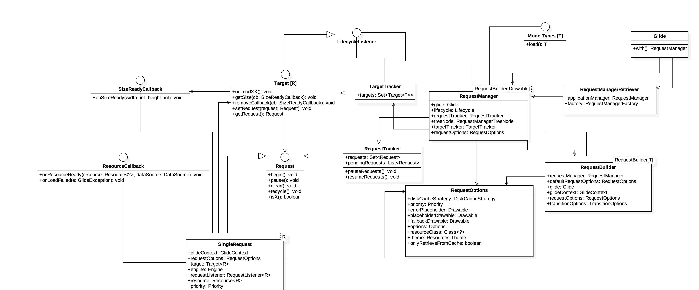

## Glide源码分析（二），基本类图介绍

经过前文[Glide源码分析（一），基本加载代码流程](Glide01.md)的分析之后，想必大家还是有点云里雾里，这里我画出了Glide基本加载流程中涉及到的类以及它们之间的关系，帮助大家更好的理解这个过程。  

Glide基本加载过程设计到的主类和关系图如下：

### 1.Glide
Glide这个类是使用图片加载库的入口类，诸如很多第三方Sdk，都用到了外观模式，通过设计一个顶层的接口，供用户使用，减少用户的学习成本。在一个app中，Glide维护了本类的唯一实例glide对象，它里面有一些列的配置以及默认配置信息，一般来说不需要额外配置，用户可以直接拿这个去使用。

### 2.RequestManagerRetriever
这个类主要负责创建RequestManager，以及创建一个隐藏的RequestManagerFragment，来感知宿主Activity的生命周期变化，它保证了对于同一个上下文Context来说，只会创建一个RequestManager对象。

### 3.RequestManager
负责管理所有的Request对象和Target对象，它实现了LificycleListener接口，在其构造方法中，将其和宿主Activity生命周期进行绑定，从而使之能够感知生命周期变化，而启动或者取消请求。RequestManager的load方法，会构建一个RequestBuilder对象，看到这个其实很清楚，它用到了建造者模式，便于请求参数的设置，让用户可以使用链式调用方便的设置自己的参数。

### 4.RequestBuilder
上面已经提到了，它是用户能够链式设置参数的基石，里面涉及了大量的请求参数，其中最重要的就是RequestOptions和TransitionOptions，前者主要涉及的是请求参数，和Request相关。后者主要作用在加载完成之后的动画上。RequestBuilder的into方法，会构建Request和Target对象，并交由RequestManager去处理。

### 5.RequestOptions
大量的请求参数，涉及到各种placeholder，缓存控制，图片最终的Transformation变换等。
### 6.Target
Glide将资源加载到一个接口中，这个接口定义了加载的生命周期方法，典型的生命周期是onLoadStarted -> onResourceReady或onLoadFailed -> onLoadCleared。但是，没有保证。如果资源位于内存中，onLoadStarted可能不会被调用，如果由于空模型对象而导致加载失败。 onLoadCleared可能永远不会被调用。
### 7.Request
一个Target对应一个Request，Request负责真正的加载流程，一般而言，Request和Target是一个双向绑定的关系，比如SingleRequest，持有一个正在加载的Target对象，将加载的状态，及时的通知对应的Target对象。
### 8.LifecycleListener
定义了需要关注的宿主的生命周期方法的接口，比如可见性onStart/onStop，以及最后的onDestroy方法。
### 9.ModelTypes
定义了load方法的所有的重载形式，以及支持自定义的返回格式。

### 总结
通过这张类图，其实比较简单的执行过程就是：  

1. Glide#with获取一个全局的单例对象RequestManagerRetriever，由它负责去获取一个和Context相关的并且对Context唯一的RequestManager对象，并且已经和宿主Activity生命周期绑定。  
2. RequestManager#load构建一个RequestBuilder对象，供用户设置大量参数，并返回一个RequestBuilder对象。
3. RequestBuilder#into构建一个Target和一个Request对象，并完成它们的双向绑定关系。在交由RequestManager之前检查是否需要发起请求，如果需要则进入下一步，否则直接结束。
4. RequestManager#track触发请求request的执行，从而简单的图片加载至此结束，后续request加载状态会反应至target上面，进而和target相关的控件会得到更新，自此一个图片就正确的呈现在ui界面上。

[下一篇 Glide源码分析（三），Engine加载资源过程](Glide03.md)