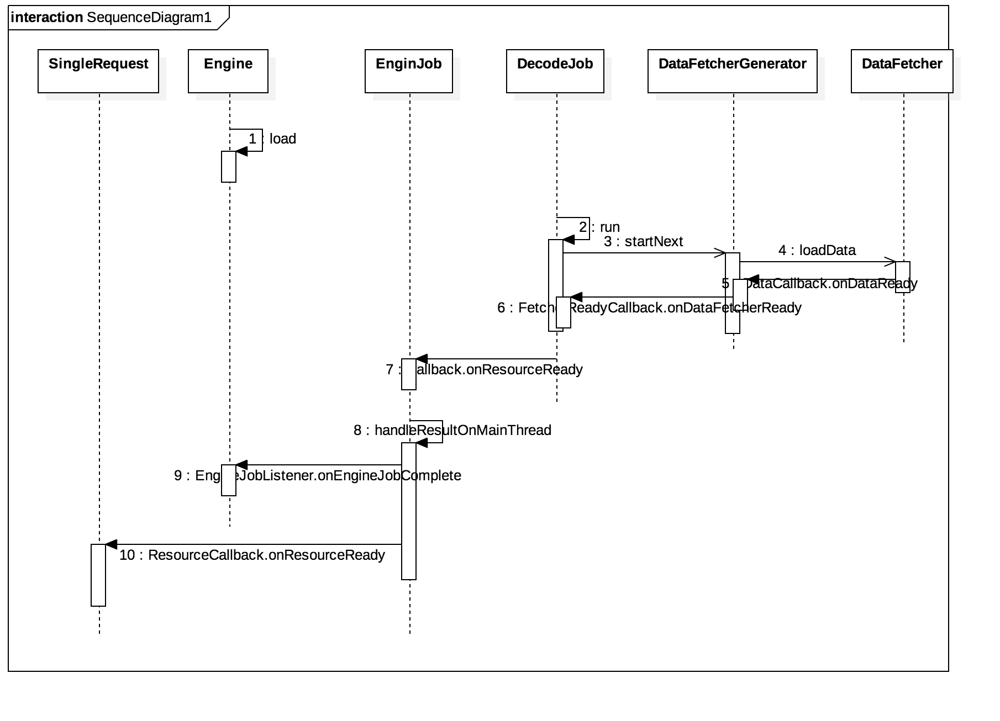

## Glide源码分析（四），DecodeJob执行过程
开始本文之前，DecodeJob它实现了Runnable接口，敏感的朋友可能已经意识到，加载代码的入口就在这里，会在一个新的线程中去加载资源。DecodeJob这个类的代码非常多，主要有以下几个重要的点。

1. 封装一些从上面传过来的参数信息，不知道是否还有印象，我们的glide大部分信息是通过前面RequestBuilder中得到的。这里，它内部构造了一个DecodeHelper类，封装了大部分的请求信息。

2. 数据加载模块DataFetcher与ModelLoader，以及加载数据的回调接口。详细参考[数据加载结构DataFetcher与ModelLoader](datafetcher_and_modelloader.md)。DataFetcher中定义了加载数据的接口，其子类很多，比如从网络加载或者是文件加载，均是由其子类具体实现。

3. DataFetcherGenerator使用已注册的{@link com.bumptech.glide.load.model.ModelLoader ModelLoaders}和一个模型生成一系列{@link com.bumptech.glide.load.data.DataFetcher DataFetchers}。在DataFetcherGenerator中，通过DecodeHelper类，我们还可以拿到ModelLoader的信息，而通过ModelLoader我们可以得到LoadData的数据结构，从而取得对应的DataFetcher，进而去获取数据。[DataFetcherGenerator结构](data_fetcher_generator.md)。

DecodeJob其他详细信息可以参考[DecodeJob结构](decode_job.md)。  
加载一个资源最终到一个ImageView上面的大致流程图如下：

> 1. SingleRequest的onSizeReady方法启动Engine的load方法，同时将ResourceCallback传入。这个ResourceCallback最终会调用相关的Target，完成资源的最终渲染。
> 2. Engine的load方法
