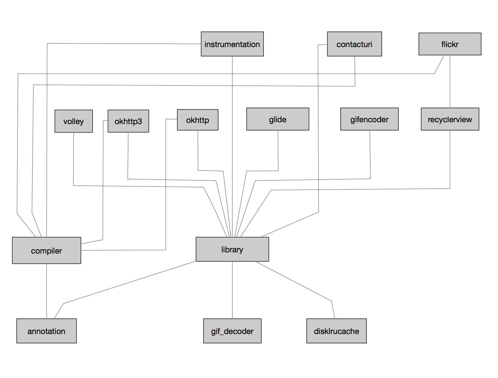

## Glide源码分析（七），总纲思路梳理
对于Glide源码分析，基本已经接近尾声，整体下来，整个Glide工程代码量还是比较大的，涉及的知识点以及设计模式也很多，很值得研究一下，这里我贴上github源码中，关于glide工程的一张简单的引用关系。如下：

这样大家面对这个强大的代码库也就不那么不知所措了，最核心的也就是library库，glide相关的绝大多数都是在这个里面的。上层不过是一些简单的扩展，比如volley与okhttp3等。为了方便大家自己研读源码，我这里给出我在研究的时候一些简要的思路。

1. 整个glide库运行时，会构建一个单例对象glide，它里面负责注册一系列的ModelLoaders和对应的ModelFetchers以及一大堆的Encoder与Decoder对象。其中ModelLoaders与ModelFetchers负责从数据源加载数据，远端或本地DickCacke；Encoder负责将数据保存至本地文件，Decoder则是一个反向的操作，负责从本地解码数据。
2. 整个运行中，只会存在一个Engine实例，一个ActiveResources，一个MemoryCache，若干个RequestManager，若干个Target与Request，一个Request中会持有一个其加载到的Resource。RequestManager与Target是与生命周期绑定的，在RequestManager中会根据生命周期方法调度其所有的Request对象，让它们取消或者重新加载。
3. Request这里我们重点分析的是SingleRequest，它里面加载成功会会持有一个EngineResource资源，EngineResource内部是一个引用计数，当计数减到0时，等待某个时机，Request被clear的时候，会将EngineResource资源从ActiveResources移动至MemoryCache，可以简单理解为一个二级缓存策略，有效提高命中率以及防止过多的操作MemoryCache造成内存抖动。
4. 每一次图片加载，不论是缓存命中，亦或是远端加载得到的，均会创建一个Request对象，同时添加至RequestManager中被管理起来并进行调度，使之也拥有生命周期。
5. MemoryCache一般是用在于多个页面之间，这里以Activity为单位，比如A页面被销毁，则A中对应的RequestManager中加载的资源会从ActiveResources移动至MemoryCache，这个时候再进入B页面的时候，如果此时B页面也加载相同的资源，那么此时MemoryCache会被命中，同时又会将资源从MemoryCache移动至ActiveResources。
6. glide一次加载大致是load创建一个RequestBuilder对象，而后通过Builder对象可以设置大量的参数信息，最后是调用into创建相应的Target以及Request对象，最终调用Engine模块启动加载。
7. Glide在加载成功之后，在onResourceDecoded中会对decode过的资源，再做一次transform，我们设置的一些属性比如CENTER_CROP、FIT_CENTER变换等，会在这里进行转换，最终通过Target渲染到对应的View上面。
8. 源码中涉及到的很多主要的类，需要仔细研究，比如Target、Resource、ModelLoader、DataFetcher、ResourceDecoder、Encoder、Key等，宏观上先理解它们的用处，而后就更容易理解代码的微观过程了，需要很有耐心的研究。

"Reading the fuck source code!"整个Glide源码相对非常复杂，我们也没有必要对每一处细节都掌握的清清楚楚，关键是理解别人设计的思想，可能光看这些文档，显然是无法理解代码中的正在奥妙之处的，这里我也只是列出了我在分析过程中的一些体会和要点，也仅仅只是给大家一个参考。纸上来得终觉浅，如果想深入一个模块，还是必须得亲自实践，不断的看代码Debug，不断的阅读源码，从源码从找到答案，解决自己的疑惑，借鉴别人的优秀设计，这样自己才能进步。讲了很多源码性的东西，Glide提供的自定义扩展模块也是相当的灵活，包括替换成自己的loader，换网络加载库等。最后我会分析Glide一些比较实用的地方，在源码的基础上做一些实践。

[下一篇 Glide源码分析（八），Glide的自定义模块扩展与实践](Glide08.md)
