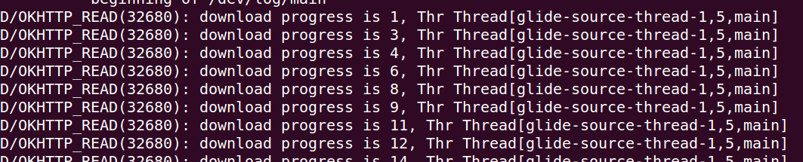
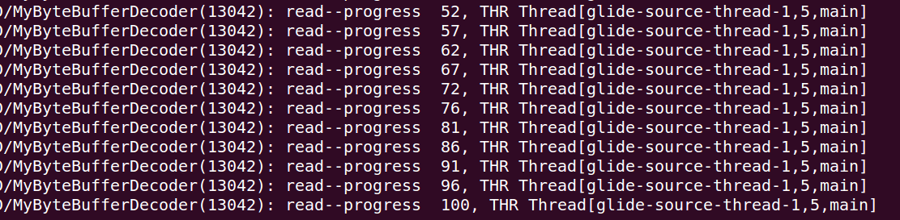

## Glide源码分析（八），Glide的自定义模块扩展与实践
### Generated API
Glide v4使用注解处理器(Annotation Processor)来生成出一个API，在Application模块中可使用该流式API一次性调用到RequestBuilder，RequestOptions和集成库中所有的选项。

GeneratedAPI模式的设计出于以下两个目的：

1. 集成库可以为Generated API扩展自定义选项。
2. 在Application模块中可将常用的选项组打包成一个选项在Generated API中使用。

#### @GlideModule
AppGlideModule的实现必须使用@GlideModule注解标记。如果注解不存在，该module将不会被Glide发现。在这个注解类中，我们一般是替换Glide初始化的时候添加的默认组件。
```
@GlideModule
public class MyAppGlideModule extends AppGlideModule {

    @Override
    public void registerComponents(@NonNull Context context, @NonNull Glide glide, @NonNull Registry registry) {
        super.registerComponents(context, glide, registry);
        OkHttpClient.Builder builder = new OkHttpClient.Builder();
        builder.addInterceptor(new LoadingInterceptor());
        OkHttpClient okHttpClient = builder.build();
        registry.replace(GlideUrl.class, InputStream.class, new OkHttpUrlLoader.Factory(okHttpClient));
    }
}

```
在我们这里，则是调用registry.replace方法，将Glide初始化过程中的
```
        .append(GlideUrl.class, InputStream.class, new HttpGlideUrlLoader.Factory())
```
替换成了
```
  .replace(GlideUrl.class,InputStream.class, new OkHttpUrlLoader.Factory(okHttpClient));
```
这个是在GlideModule中常见的实用，替换默认组件，换成自定义的组件，在实际项目中，非常的方便和便于拓展，我这里是替换了一个下载框架，加了一个拦截器，实现下载的进度条监听，后面我会简单的贴相关的代码细节。
#### @GlideExtension
Glide Generated API 可在Application和Library中被扩展。扩展使用被注解的静态方法来添加新的选项、修改现有选项、甚至添加额外的类型支持。

@GlideExtension 注解用于标识一个扩展Glide API的类。任何扩展Glide API的类都必须使用这个注解来标记，否则其中被注解的方法就会被忽略。

被@GlideExtension注解的类应以工具类的思维编写。这种类应该有一个私有的、空的构造方法，应为final类型，并且仅包含静态方法。被注解的类可以含有静态变量，可以引用其他的类或对象。

在Application模块中可以根据需求实现任意多个被@GlideExtension注解的类，在Library模块中同样如此。当AppGlideModule被发现时，所有有效的Glide扩展类会被合并，所有的选项在API中均可以被调用。合并冲突会导致Glide的Annotation Processor抛出编译错误。

被@GlideExtention注解的类有两种扩展方式：

1. GlideOption - 为RequestOptions添加一个自定义的选项。
2. GlideType - 添加对新的资源类型的支持(GIF，SVG 等等)。

注解@GlideOption和＠GlideType均是修饰一个方法，前者修饰的会在GlideOptions与GlideRequest中生成方法，后者修饰的会在GlideRequests中生成方法，一个简单的例子如下：  

GlideExtension扩展
```
@GlideExtension
public class MyAppExtension {

    private static final int MIN_THUMB_SIZE = 100;

    private static final RequestOptions DECODE_TYPE_GIF = RequestOptions.decodeTypeOf(GifDrawable.class).lock();

    private MyAppExtension() {

    }

    @GlideOption
    public static void miniThumb(RequestOptions options) {
        options
                .fitCenter()
                .override(MIN_THUMB_SIZE);
    }

    @GlideType(GifDrawable.class)
    public static void asMyGif(RequestBuilder<GifDrawable> requestBuilder) {
        requestBuilder
                .transition(new DrawableTransitionOptions())
                .apply(DECODE_TYPE_GIF);
    }


}
```
GlideOptions(继承至RequestOptions)中生成方法：
```
@CheckResult
@NonNull
public GlideOptions miniThumb() {
  if (isAutoCloneEnabled()) {
    return clone().miniThumb();
  }
  MyAppExtension.miniThumb(this);
  return this;
}
```
对应GlideRequest(继承至RequestBuilder)中方法：
```
@CheckResult
@NonNull
public GlideRequest<TranscodeType> miniThumb() {
  if (getMutableOptions() instanceof GlideOptions) {
    this.requestOptions = ((GlideOptions) getMutableOptions()).miniThumb();
  } else {
    this.requestOptions = new GlideOptions().apply(this.requestOptions).miniThumb();
  }
  return this;
}
```
GlideRequests(继承至RequestManager)生成方法：
```
/**
  * @see MyAppExtension#asMyGif(RequestBuilder)
  */
 @NonNull
 @CheckResult
 public GlideRequest<GifDrawable> asMyGif() {
   GlideRequest<GifDrawable> requestBuilder = this.as(GifDrawable.class);
   MyAppExtension.asMyGif(requestBuilder);
   return requestBuilder;
 }
```
整个注解非常的便于扩展，用@GlideOption注解的静态方法用于扩展RequestOptions，用@GlideType注解的静态方法用于扩展RequestManager实际项目中可以根据需要自己进行扩展。关于其API的使用，参考官方文档，非常的详细。http://bumptech.github.io/glide/

讲了太多的代码和逻辑，学习不能不实践，我始终相信，理论是内功，是成为一个高手必备的，当然实践也不可小视。下面我来实现图片加载进度的监听，一个例子是监听第一次网络加载的时候，另一个例子是监听从DiskCache中加载的过程，当然这个几乎是比较快的了。下面分别来实现。
### 网络加载时图片加载监听

1. 实现自己的ModelLoader与DataFetcher，这里我是使用Okhttp这个库。在自己的@GlideModule中，实现如下：

  ```
  @GlideModule
  public class MyAppGlideModule extends AppGlideModule {

      @Override
      public void registerComponents(@NonNull Context context, @NonNull Glide glide, @NonNull Registry registry) {
          super.registerComponents(context, glide, registry);
          OkHttpClient.Builder builder = new OkHttpClient.Builder();
          builder.addInterceptor(new LoadingInterceptor());
          OkHttpClient okHttpClient = builder.build();
          registry.replace(GlideUrl.class, InputStream.class, new OkHttpUrlLoader.Factory(okHttpClient));
      }
  }

  ```
这里定义了一个拦截器LoadingInterceptor，用于监听下载的进度信息，构造了一个带拦截器的OkHttpClient对象，并传入至OkHttpUrlLoader的工厂中。

2. OkHttpUrlLoader代码片段

  ```
  public class OkHttpUrlLoader implements ModelLoader<GlideUrl, InputStream> {

    private final Call.Factory client;

    // Public API.
    @SuppressWarnings("WeakerAccess")
    public OkHttpUrlLoader(@NonNull Call.Factory client) {
      this.client = client;
    }

    @Override
    public boolean handles(@NonNull GlideUrl url) {
      return true;
    }

    @Override
    public LoadData<InputStream> buildLoadData(@NonNull GlideUrl model, int width, int height,
        @NonNull Options options) {
      return new LoadData<>(model, new OkHttpStreamFetcher(client, model));
    }

    /**
     * The default factory for {@link OkHttpUrlLoader}s.
     */
    // Public API.
    @SuppressWarnings("WeakerAccess")
    public static class Factory implements ModelLoaderFactory<GlideUrl, InputStream> {
      private static volatile Call.Factory internalClient;
      private final Call.Factory client;

      private static Call.Factory getInternalClient() {
        if (internalClient == null) {
          synchronized (Factory.class) {
            if (internalClient == null) {
              internalClient = new OkHttpClient();
            }
          }
        }
        return internalClient;
      }

      /**
       * Constructor for a new Factory that runs requests using a static singleton client.
       */
      public Factory() {
        this(getInternalClient());
      }

      /**
       * Constructor for a new Factory that runs requests using given client.
       *
       * @param client this is typically an instance of {@code OkHttpClient}.
       */
      public Factory(@NonNull Call.Factory client) {
        this.client = client;
      }

      @NonNull
      @Override
      public ModelLoader<GlideUrl, InputStream> build(MultiModelLoaderFactory multiFactory) {
        return new OkHttpUrlLoader(client);
      }

      @Override
      public void teardown() {
        // Do nothing, this instance doesn't own the client.
      }
    }
  }
```
3. OkHttpUrlLoader代码片段
```
public class OkHttpStreamFetcher implements DataFetcher<InputStream>, okhttp3.Callback {
  private static final String TAG = "OkHttpFetcher";
  private final Call.Factory client;
  private final GlideUrl url;
  private InputStream stream;
  private ResponseBody responseBody;
  private DataCallback<? super InputStream> callback;
  // call may be accessed on the main thread while the object is in use on other threads. All other
  // accesses to variables may occur on different threads, but only one at a time.
  private volatile Call call;

  // Public API.
  @SuppressWarnings("WeakerAccess")
  public OkHttpStreamFetcher(Call.Factory client, GlideUrl url) {
    this.client = client;
    this.url = url;
  }

  @Override
  public void loadData(@NonNull Priority priority,
      @NonNull final DataCallback<? super InputStream> callback) {
    Request.Builder requestBuilder = new Request.Builder().url(url.toStringUrl());
    for (Map.Entry<String, String> headerEntry : url.getHeaders().entrySet()) {
      String key = headerEntry.getKey();
      requestBuilder.addHeader(key, headerEntry.getValue());
    }
    Request request = requestBuilder.build();
    this.callback = callback;

    call = client.newCall(request);
    call.enqueue(this);
  }

  @Override
  public void onFailure(@NonNull Call call, @NonNull IOException e) {
    if (Log.isLoggable(TAG, Log.DEBUG)) {
      Log.d(TAG, "OkHttp failed to obtain result", e);
    }

    callback.onLoadFailed(e);
  }

  @Override
  public void onResponse(@NonNull Call call, @NonNull Response response) {
    responseBody = response.body();
    if (response.isSuccessful()) {
      long contentLength = Preconditions.checkNotNull(responseBody).contentLength();
      stream = ContentLengthInputStream.obtain(responseBody.byteStream(), contentLength);
      callback.onDataReady(stream);
    } else {
      callback.onLoadFailed(new HttpException(response.message(), response.code()));
    }
  }

  @Override
  public void cleanup() {
    try {
      if (stream != null) {
        stream.close();
      }
    } catch (IOException e) {
      // Ignored
    }
    if (responseBody != null) {
      responseBody.close();
    }
    callback = null;
  }

  @Override
  public void cancel() {
    Call local = call;
    if (local != null) {
      local.cancel();
    }
  }

  @NonNull
  @Override
  public Class<InputStream> getDataClass() {
    return InputStream.class;
  }

  @NonNull
  @Override
  public DataSource getDataSource() {
    return DataSource.REMOTE;
  }
}
```
4. 拦截器LoadingInterceptor实现

  ```
  public class LoadingInterceptor implements Interceptor {
      @Override
      public Response intercept(Chain chain) throws IOException {
          Request request = chain.request();
          Response response = chain.proceed(request);
          ResponseBody body = response.body();
          Response newResponse = response.newBuilder().body(new NewResponseBody(body)).build();
          return newResponse;
      }
  }
  ```  
5. 自定义的ResponseBody实现

```
public class NewResponseBody extends ResponseBody {

    private BufferedSource bufferedSource;
    private ResponseBody responseBody;

    public NewResponseBody(ResponseBody responseBody) {
        this.responseBody = responseBody;
    }

    @Override
    public MediaType contentType() {
        return responseBody.contentType();
    }

    @Override
    public long contentLength() {
        return responseBody.contentLength();
    }

    @Override
    public BufferedSource source() {
        if (bufferedSource == null) {
            bufferedSource = Okio.buffer(new ProgressSource(responseBody.source()));
        }
        return bufferedSource;
    }

    private class ProgressSource extends ForwardingSource {

        long totalBytesRead = 0;

        public ProgressSource(Source delegate) {
            super(delegate);
        }

        @Override
        public long read(Buffer sink, long byteCount) throws IOException {
            long bytesRead = super.read(sink, byteCount);
            long fullLength = responseBody.contentLength();
            if (bytesRead == -1) {
                totalBytesRead = fullLength;
            } else {
                totalBytesRead += bytesRead;
            }
            int progress = (int) (100f * totalBytesRead / fullLength);
            Log.d("OKHTTP_READ", "download progress is " + progress + ", Thr " + Thread.currentThread());
            return bytesRead;
        }
    }
}

```
再次运行工程代码，可以看到log信息如下：



由此可见，我们已经能监听到了下载的进度信息，在这里，我们可以定义相关的接口，通知到上层调用模块，显示进度条的具体进度。

### DiskCache加载时图片加载监听
1. 同样的逻辑，注册我们自己的组件，这里是实现了一个ResourceDecoder的逻辑，注册至MyAppGlideModule中。

  ```
  @Override
    public void registerComponents(@NonNull Context context, @NonNull Glide glide, @NonNull Registry registry) {
        super.registerComponents(context, glide, registry);
        Downsampler downsampler = new Downsampler(registry.getImageHeaderParsers(),
                context.getResources().getDisplayMetrics(), glide.getBitmapPool(), glide.getArrayPool());
        MyByteBufferBitmapDecoder byteBufferBitmapDecoder = new MyByteBufferBitmapDecoder(downsampler);

        registry.prepend(Registry.BUCKET_BITMAP, ByteBuffer.class, Bitmap.class, byteBufferBitmapDecoder);
        registry.replace(GlideUrl.class, InputStream.class, new OkHttpUrlLoader.Factory(okHttpClient));
    }
  ```

2. MyByteBufferBitmapDecoder实现细节


  ```
  public class MyByteBufferBitmapDecoder implements ResourceDecoder<ByteBuffer, Bitmap> {

    private static final String TAG = "MyByteBufferDecoder";
    private final Downsampler downsampler;

    public MyByteBufferBitmapDecoder(Downsampler downsampler) {
      this.downsampler = downsampler;
    }

    @Override
    public boolean handles(@NonNull ByteBuffer source, @NonNull Options options) {
      return downsampler.handles(source);
    }

    @Override
    public Resource<Bitmap> decode(@NonNull ByteBuffer source, int width, int height,
        @NonNull Options options)
        throws IOException {
      InputStream is = new MyByteBufferStream(source);
      return downsampler.decode(is, width, height, options);
    }


    private static class MyByteBufferStream extends InputStream {
      private static final int UNSET = -1;
      @NonNull private final ByteBuffer byteBuffer;
      private int markPos = UNSET;
      private long size;

      MyByteBufferStream(@NonNull ByteBuffer byteBuffer) {
        this.byteBuffer = byteBuffer;
        size = available();
        Log.d(TAG, "size -- " + size);
      }

      @Override
      public int available() {
        return byteBuffer.remaining();
      }

      @Override
      public int read() {
        if (!byteBuffer.hasRemaining()) {
          return -1;
        }
        return byteBuffer.get();
      }

      @Override
      public synchronized void mark(int readLimit) {
        markPos = byteBuffer.position();
      }

      @Override
      public boolean markSupported() {
        return true;
      }

      @Override
      public int read(@NonNull byte[] buffer, int byteOffset, int byteCount) throws IOException {
        Log.d(TAG, "read--progress  " + ((size - available()) * 100 / size) + ", THR " + Thread.currentThread());
        if (!byteBuffer.hasRemaining()) {
          return -1;
        }
        int toRead = Math.min(byteCount, available());
        byteBuffer.get(buffer, byteOffset, toRead);
        return toRead;
      }

      @Override
      public synchronized void reset() throws IOException {
        if (markPos == UNSET) {
          throw new IOException("Cannot reset to unset mark position");
        }
        // reset() was not implemented correctly in 4.0.4, so we track the mark position ourselves.
        byteBuffer.position(markPos);
      }

      @Override
      public long skip(long byteCount) throws IOException {
        if (!byteBuffer.hasRemaining()) {
          return -1;
        }

        long toSkip = Math.min(byteCount, available());
        byteBuffer.position((int) (byteBuffer.position() + toSkip));
        return toSkip;
      }
    }
  }

  ```

这里是模仿源码中照葫芦画瓢，包装ByteBuffer，而后监听其read方法的调用，进而打印出当前的加载进度。结果如下：




### 总结

这里整个Glide系列文章也就结束了，从实践中我们可以感受到，理解源码对我们进行一些扩展非常的有帮助，本系列没有涉及到具体API的使用，有需要建议阅读官方文档，或者借鉴网上的资源，整个Glide工程还是相当优秀的，特别对于现在的4.7版本，对比老的3.9版本，代码优化了许多，各个调用模块相对很清晰，涉及了大量的设计模式，非常适合阅读。本系列可能对于很多细节并未能讲解的很清楚，如有理解不当，欢迎一起讨论。
