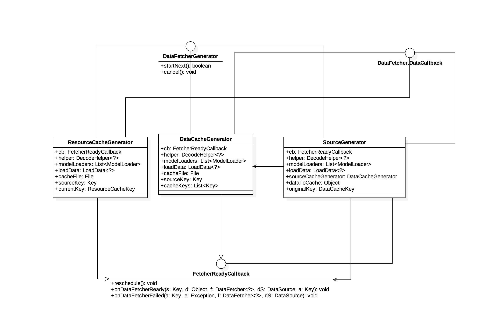

## DataFetcherGenerator结构
UML如下：

- DataFetcherGenerator  
使用已注册的ModelLoaders{@link com.bumptech.glide.load.model.ModelLoader}和一个模型构造一系列的DataFetchers{@link com.bumptech.glide.load.data.DataFetcher}。
- FetcherReadyCallback  
当generator从{@link com.bumptech.glide.load.data.DataFetcher}加载数据完成会回调此接口。
- ResourceCacheGenerator  
DataFetcherGenerator实现类，从包含缩减采样/转换资源数据的缓存文件生成DataFetchers{@link com.bumptech.glide.load.data.DataFetcher}。
- DataCacheGenerator  
DataFetcherGenerator实现类，从包含原始未修改源数据的缓存文件生成DataFetchers{@link com.bumptech.glide.load.data.DataFetcher}。
- SourceGenerator  
DataFetcherGenerator实现类，使用已注册的ModelLoaders{@link com.bumptech.glide.load.model.ModelLoader}和为加载提供的模型从原始源数据生成DataFetchers{@link com.bumptech.glide.load.data.DataFetcher}。
- DataFetcher.DataCallback  
DataFetchers{@link com.bumptech.glide.load.data.DataFetcher}加载数据完成时候的回调。

DataFetcherGenerator三个实现类ResourceCacheGenerator、DataCacheGenerator与SourceGenerator，均实现了DataFetcher.DataCallback接口，这里我们可以知道，在Generator中，会调用相关DataFetchers去获取数据，最终回调结果会在Generator中得到处理。显然我们的Generator也会给外面去使用，这里使用它的正是DecodeJob，所以这里提供了一个接口FetcherReadyCallback，将加载数据的结果进一步交给更上层的去处理。在之后的DecodeJob分析中，我们会分析这些callback之间的关系。

