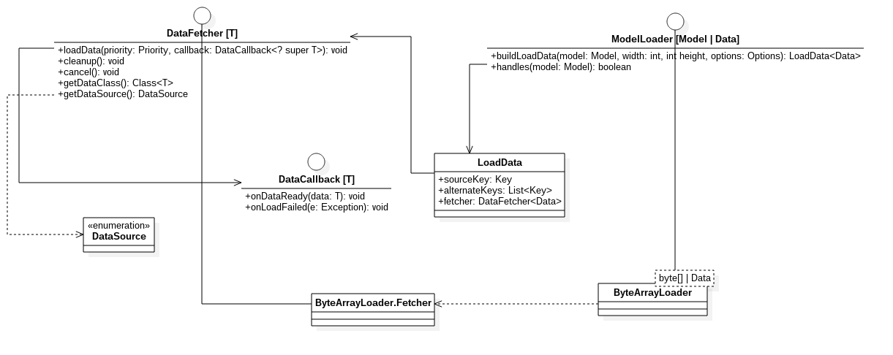

## 数据加载结构DataFetcher与ModelLoader
UML如下：

glide数据加载模块，基本结构如上图所示，DataFetcher定义了取数据的接口，具体的通过何种方式取数据，网络还是本地，均是由其子类实现，接下来我们介绍DataFetcher的几个子类。ModelLoader是一个工厂接口，用于将任意复杂的数据模型转换为具体数据类型，从而能够使用DataFetcher去获取由该模型表示的资源的数据，具体的ModelLoader实现类会根据自己的需要构建自己的DataFetcher实现类。整个加载过程是从ModelLoader开始，构造出相应的DataFetcher。调用buildLoadData返回给上层一个LoadData对象。LoadData内部持有一个DataFetcher的引用，在具体加载地方，通过使用LoadData对象，获取其DataFetcher引用，从而调用DataFetcher#loadData方法，开始执行加载。最后在DataFetcher的DataCallback中给予数据加载的状态，成功或者失败。供上层调用模块去处理加载结果。

### DataFetcher
- DataSource  
指示一些检索到的数据的来源。目前有五种：  
LOCAL:表示数据可能是从设备本地获取的。  
REMOTE:表示数据是从设备以外的远程源检索的。  
DATA_DISK_CACHE:表示数据是从设备高速缓存未经修改而检索的。  
RESOURCE_DISK_CACHE:表示数据是从设备缓存中的修改内容中检索的。  
MEMORY_CACHE:表示数据是从内存缓存中检索的。
- DataFetcher  
延迟检索能够用作资源加载的数据。
- DataCallback  
加载数据成功和失败的回调。

- LocalUriFetcher  
DataFetcher实现类，它使用{@link android.content.ContentResolver}从指向本地资源的Uri加载数据。
- AssetFileDescriptorLocalUriFetcher  
LocalUriFetcher子类，具体加载的数据类型是AssetFileDescriptor。
- FileDescriptorLocalUriFetcher  
LocalUriFetcher子类，具体加载的数据类型是ParcelFileDescriptor。
- StreamLocalUriFetcher  
LocalUriFetcher子类，具体加载的数据类型是InputStream。

- AssetPathFetcher
DataFetcher实现类，它使用{@link android.content.res.AssetManager}从asset path中获取数据的抽象类。
- FileDescriptorAssetPathFetcher  
AssetPathFetcher子类，具体加载的数据类型是ParcelFileDescriptor。
- StreamAssetPathFetcher  
AssetPathFetcher子类，具体加载的数据类型是InputStream。

- HttpUrlFetcher  
DataFetcher实现类，具体加载的数据类型为InputStream，从网络Url中获取数据。
- ThumbFetcher  
DataFetcher实现类，具体加载的数据类型为InputStream，从缩略图文件中获取数据。

### ModelLoader
- ModelLoader  
一个工厂接口，用于将任意复杂的数据模型转换为具体数据类型，从而能够使用DataFetcher去获取由该模型表示的资源的数据。
- LoadData  
一系列Key和DataFetcher组合的一个数据结构。
- HttpGlideUrlLoader  
ModelLoader实现类，内部会构建一个HttpUrlFetcher对象。
- FileLoader  
ModelLoader实现类，内部会构建一个FileFetcher对象。

glide库中提供了大致20种ModelLoader实现类，每个均会创建一个相应的DataFetcher对象，其他的就不一一列出了。有兴趣的可以自行看库工程的代码，看一些其他实现类。
