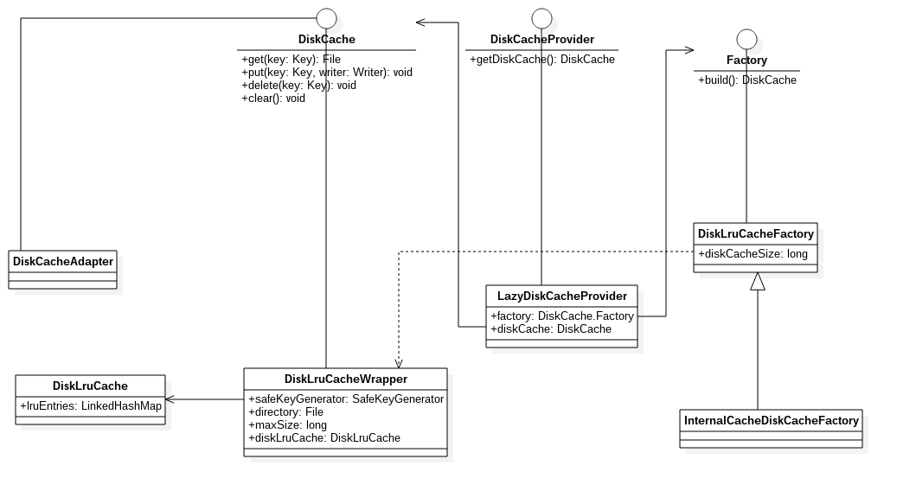

## DiskCache结构
UML如下：

- DiskCache  
定义了从磁盘缓存中写入和读取的接口。
- DiskLruCache  
基于文件系统的一个有限空间的缓存，每一个缓存项都有一个字符串的键和一个固定数量的值，每个键必须匹配正则表达式（[a-z0-9_-]{1,120}）。值可以是字节序列，随机流或者文件。内部也是基于LRU算法，底层由LinkedHashMap实现。
- Factory  
DiskCache工厂接口，这里主要是为了延迟创建磁盘缓存。
- DiskLruCacheFactory  
在指定的磁盘缓存目录中创建基于DiskLruCache的磁盘缓存。
- InternalCacheDiskCacheFactory  
在内部磁盘缓存目录中创建基于DiskLruCache的磁盘缓存。
- DiskLruCacheWrapper  
默认的磁盘缓存实现，其内部使用了DiskLruCache，基于LRU算法。
- SafeKeyGenerator  
从{@link com.bumptech.glide.load.Key}生成并缓存安全且唯一的字符串文件名的类。
- DiskCacheAdapter  
一个简单的DiskCache实现类，所有实现均为空实现。
- DiskCacheProvider  
一个接口，提供了一个获取DiskCache实例的方法。
- LazyDiskCacheProvider  
实现了DiskCacheProvider，具体实现了构造DiskCache实例的过程，具体的构造是由内部的一个DiskCache.Factory成员变量负责构建。

在工程中，我们的DiskCache的创建流程是由一个叫DiskCacheProvider的类实现的，它内部需要一个DiskCache.Factory对象，默认使用的Factory是InternalCacheDiskCacheFactory，最终对应的DiskCache的实现类就是DiskLruCacheWrapper。当然我们可以在GlideBuilder的setDiskCache通过设置自己的DiskCache.Factory，从而实现其build方法，来定义自己的DiskCache实现。
