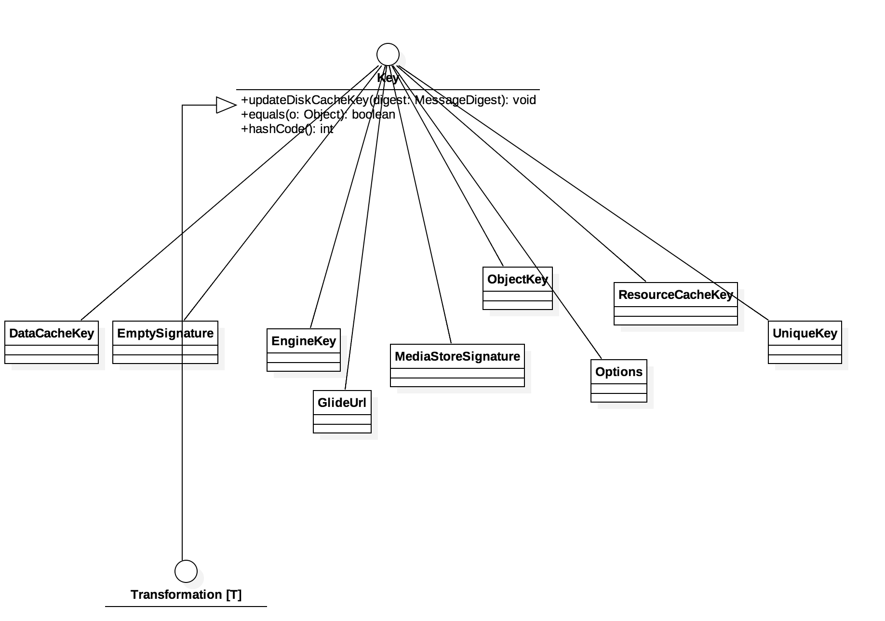

## Key结构
UML如下：

- Key  
唯一标识一些数据的接口。实现必须实现{Object＃equals（Object}和{Object＃hashCode（）}。 通常希望实现将所有在{@link java.lang.Object＃equals（Object）}}和{@link Object＃hashCode（）}}中使用的唯一标识信息添加到给定的{@link java.security.MessageDigest } in {@link #updateDiskCacheKey（java.security.MessageDigest）}}，尽管这个要求对于部分缓存密钥签名来说并不严格。

- ObjectKey  
一个通用的Object包装对象的Key，通过委托，由其内部的object决定相关key属性。 
- Options  
另外一种实现形式，相关key签名由一组Option决定，Option定义了一些可选组件，解码器、编码器、模型加载器等

- DataCacheKey  
原始源数据的缓存键，与任何请求的签名搭配使用
- ResourceCacheKey  
用于采样和转换资源数据的缓存键，与任何请求的签名搭配使用。
- UniqueKey  
未知

- EmptySignature  
一个空的签名key，并且是单例的形式，所有用到此key的地方均是同一份实例
- MediaStoreSignature  
基于来自媒体数据的独特签名，用于检测常见的更改，比如编辑、旋转和临时文件替换

- EngineKey  
用于多路复用负载的内存缓存键
- GlideUrl  
未知
- Transformation  
一个用于在一个实现了equals和hashCode方法以标识的内存缓存变换或updateDiskCacheKey方法以标识的磁盘缓存变换的资源上执行各种转换的类