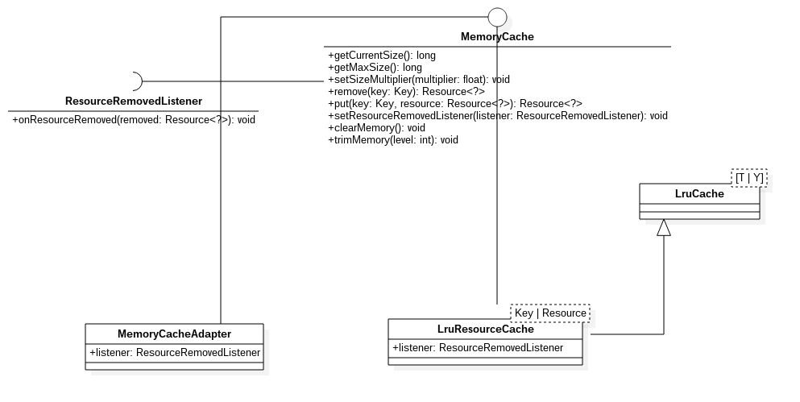

## MemoryCache结构
UML如下：

- MemoryCache  
定义了在内存中添加和移除资源的接口，还提供了获取当前缓存信息的接口，如缓存最大值以及当前的缓存大小(单位字节)。
- ResourceRemovedListener  
在缓存中，每当有资源被移除，该接口会得到回调。
- MemoryCacheAdapter  
一个简单的实现了MemoryCache的子类，实际工程并不会使用它，目前仅在测试用例中。
- LruCache  
一个使用LRU算法移除元素的有限制的缓存。内部使用了LinkedHashMap数据结构来实现了LRU算法，关键点在于
LinkedHashMap构造方法的第三个参数accessOrder。
- LruResourceCache  
一个对Glide#Resource的LRU内存缓存。

在工程中，我们的MemoryCache的实现就是LruResourceCache，当然我们可以在GlideBuilder 的setMemoryCache设置自己的内存缓存。
