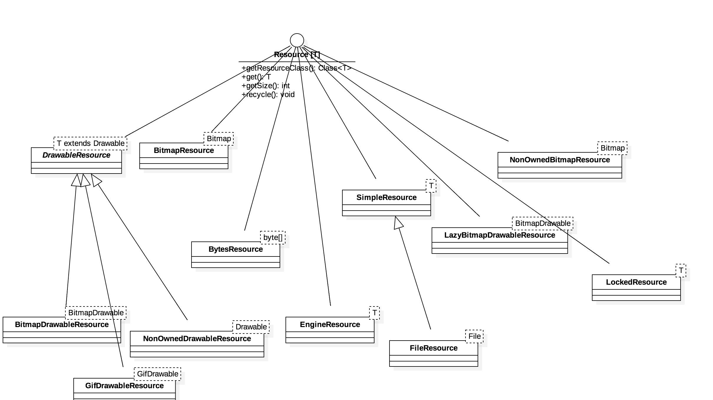

## Resource结构
UML图如下：

- Resource  
一个包装了特定类型的资源接口，并且能够汇集和重用。

- DrawableResource  
包装了Drawable相关的资源，其直接子类有BitmapDrawableResource、GifDrawableResource和NonOwnerDrawableResource。

- BitmapResource  
包装了Bitmap的资源。

- NonOwnedBitmapResource  
包装了Bitmap的非拥有的资源，bitmap不会被回收。

- BytesResource  
包装了字节数组的资源。  

- SimpleResource  
包装任意对象的资源，所使用的用途只包括没有尺寸且不能回收/关闭的资源对象。直接之类是FileResource，指定了该对象为文件对象。

- LazyBitmapDrawableResource  
一个包装了BitmapDrawable相关的延迟分配的资源。

- LockedResource  
一个可以推迟被回收的资源，直到unlock方法被调用。

- EngineResource  
一个允许引用统计的包装接口的资源。
